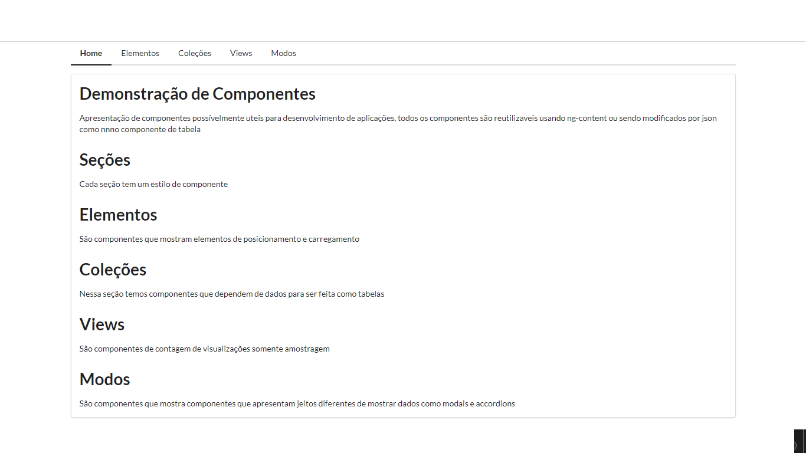
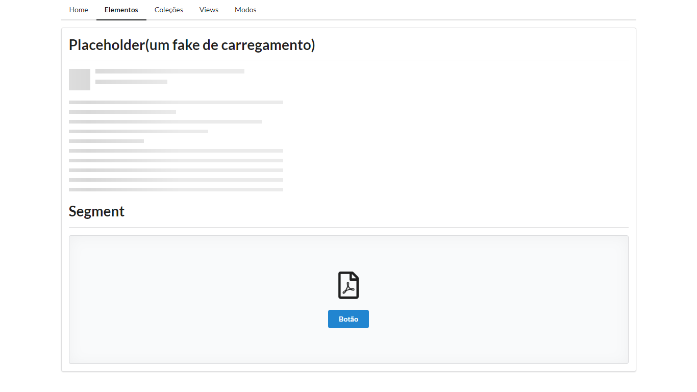
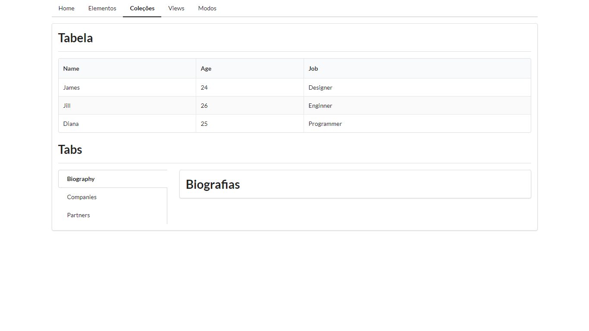
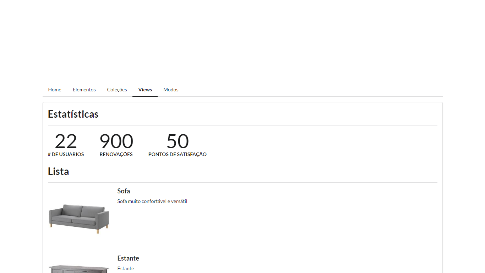
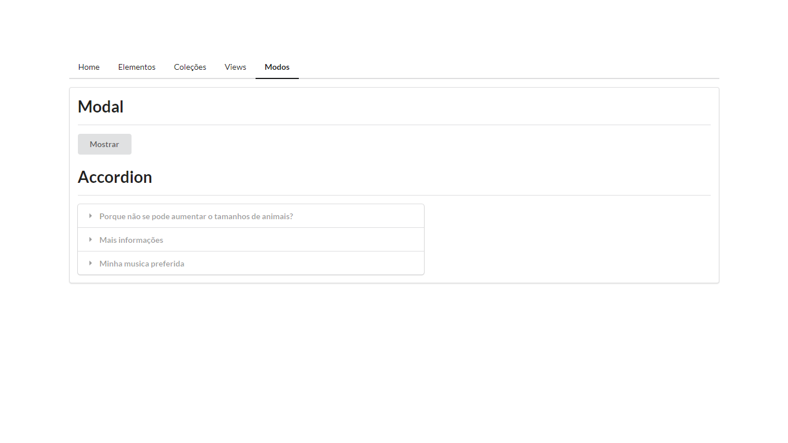
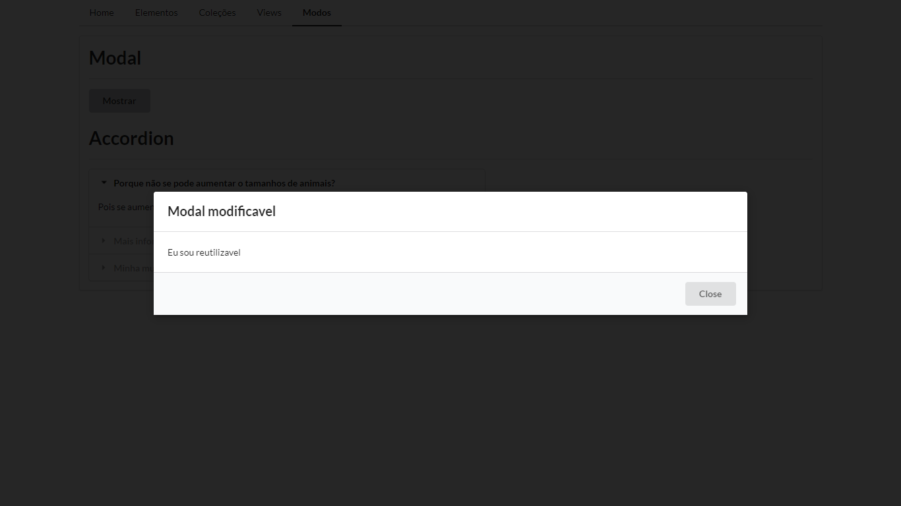
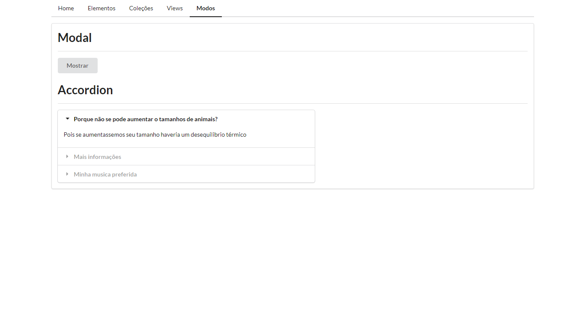
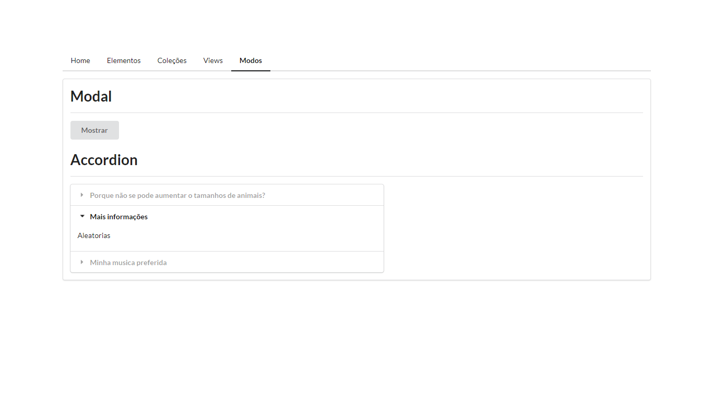
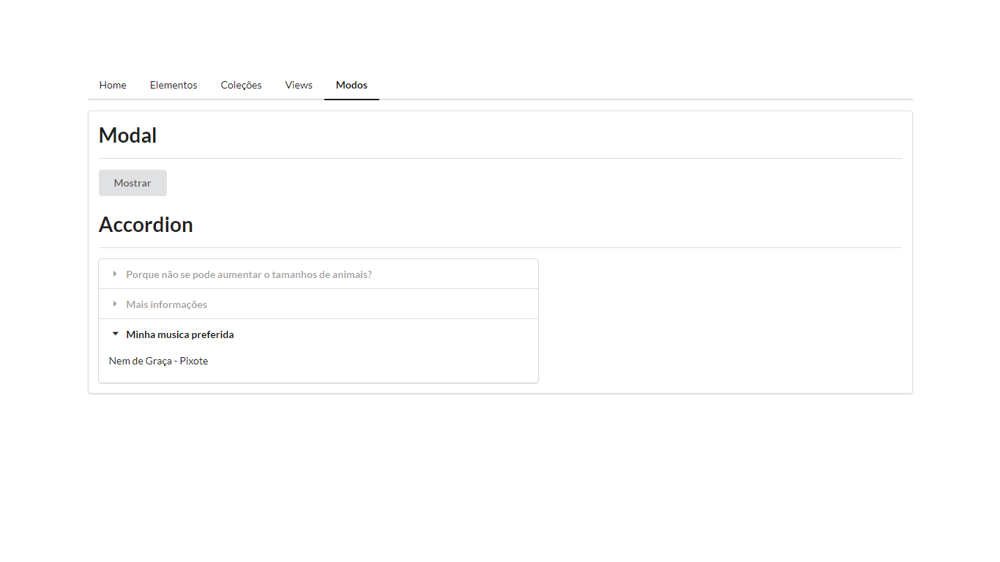

# Componentesuteis
Esse projeto é um conjunto de componentes uteis para desenvolvimento web aonde eles foram pensados para serem o mais reutilizaveis o possivel
## Home
Pagina só com algumas explicações do projeto

## Elementos
Pagina com alguns elementos de estruturação de projetos

## Coleções
 Pagina só com alguns componentes que são fazem coleções de informações
 ### Tabela
 A tabela é formada a partir de dois jsons um com os headers e outro com os dados
 ### Tabs
Um componente que faz um mini-router ou seja tem uma navegação de componentes dentro dele 
 

## Views
São componentes que fazem amostragem de visualizações ou de produtos, etc

## Modos
São componentes que fazem diferentes jeitos de visualizações como modais e accordions

### Modal

### Accordion

